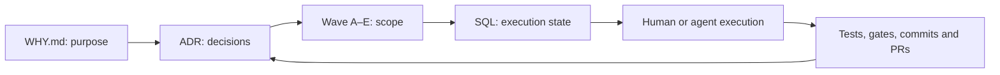
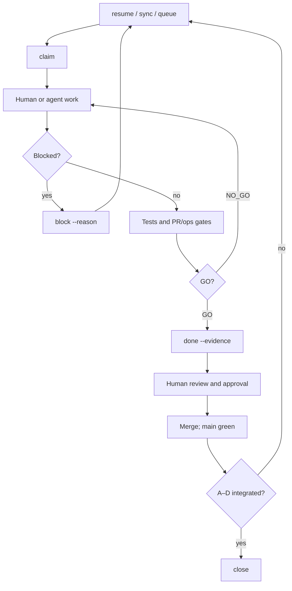

<div align="center">

# WHW — Why · How · What

### Portable, resumable, verifiable work for humans and coding agents

[](https://github.com/fabioeloi/WHW/actions/workflows/ci.yml)
[](https://www.npmjs.com/package/@fabioeloi/whw)
[](package.json)
[](package.json)
[](LICENSE)

[Leia em português brasileiro](README.pt-BR.md)

</div>

WHW organizes work around **purpose, decisions, SQL state and evidence**.
Keep the delivery contract in your repository, resume after interruptions,
and review what changed with artifacts you can rerun.

**0.2.0 is published** on [npm](https://www.npmjs.com/package/@fabioeloi/whw)
and [GitHub](https://github.com/fabioeloi/WHW/releases/tag/v0.2.0).
This repository's documentation evolves independently of that immutable package.

## Contents

[Value](#value) · [Audience](#audience) · [Quick start](#quick-start) ·
[Architecture](#architecture) · [Delivery loop](#delivery-loop) ·
[Continuity](#continuity) · [Compatibility](#compatibility) ·
[Evidence and limits](#evidence-and-limits) · [Documentation](#documentation) ·
[Roadmap](#roadmap) · [Contributing](#contributing)

## Value

| Situation | WHW practice | Reviewable artifact |
| --- | --- | --- |
| Resume after an interruption | Revalidate Git, queue and gates with `resume` | Baseline, SQL status and gate checkpoints |
| Change tools | Carry the contract with `handoff` and canonical `AGENTS.md` | Migration document and repository files |
| Explain a decision | Link a wave to an ADR and WHY | Versioned decision record |
| Review delivery | Require evidence and GO/NO_GO checks | Commits, test commands and PRs |

Durable context, governance and verification are the positioning priorities.
[September 2026 research and market context](docs/why/positioning.md) informs
these priorities; it does not establish WHW performance results.

## Audience

For developers and technical leaders who want explicit scope, continuity
and evidence while using humans or coding agents. Start with one small wave.
WHW supplies a process CLI and file contracts; your team supplies the code,
project-specific checks, reviewers and approval policy.

## Quick start

Requires Node.js **≥22.13**, npm and Git. WHW has **zero runtime dependencies**;
`npx` still downloads the package on first use. Review generated files before
adopting them in an existing repository; this example starts with an empty one.

```bash
mkdir whw-demo
cd whw-demo
git init
npx @fabioeloi/whw@0.2.0 init --tools claude,cursor,codex,copilot,gemini
npx @fabioeloi/whw@0.2.0 doctor
npx @fabioeloi/whw@0.2.0 program new adoption --waves 1
npx @fabioeloi/whw@0.2.0 wave new first-change --adr 0001
```
In this new repository, the generated program ADR is `0001` and the wave is
`001`. Existing repositories allocate the next available numbers: use the
actual generated identifiers. Edit `WHY.md`, the program charter (scope,
exclusions, wave map and close criteria), and `docs/plan.md` before executing.

```bash
npx @fabioeloi/whw@0.2.0 sync --all
npx @fabioeloi/whw@0.2.0 queue
npx @fabioeloi/whw@0.2.0 claim wave001-A
```
Finish A's planning artifacts and review them before recording completion:

```bash
npx @fabioeloi/whw@0.2.0 gate run --tier pr
npx @fabioeloi/whw@0.2.0 done \
  wave001-A --evidence "planning/wave-001-first-change.todos.sql; docs/adr/0001-program-adoption.md; npx @fabioeloi/whw@0.2.0 gate run --tier pr"
npx @fabioeloi/whw@0.2.0 status
```
This completes **A only**. B–E remain pending. Repeat the contract per letter;
`close` requires A–D done, the ADR addendum and green sync gates. Never close
immediately after A. See [waves](docs/how/waves.md) and the
[worked example](examples/hello-wave/).

The installed package runs through `npx @fabioeloi/whw@0.2.0` (or `whw` after
explicit installation). `init` scaffolds process files; it does **not** copy
`bin/` or `src/`. Only inside a WHW source checkout use `node ./bin/whw.js`.

## Architecture


`planning/*.todos.sql` is versioned input. `sync` loads local SQLite state
in `.whw/state.db`; the dependency-aware queue drives execution. The database
is ignored by Git: retain evidence in versioned artifacts and regenerate
state through WHW commands. File handoffs preserve process context, not a
model's hidden memory or private chat history.

## Delivery loop

| Letter | Responsibility | Delivery |
| --- | --- | --- |
| A | Plan | Charter, SQL seeds, dependencies and acceptance |
| B | Build | Scoped implementation |
| C | Verify | Independent checks and rerunnable evidence |
| D | Decide | ADR addendum with outcome and limits |
| E | Close | Canonical SQL close, metrics and integration |


A wave is terminal only when E merges. PR gates cover planning, ADR linkage,
wave sync, README sync, adapter parity and secret scanning. Ops gates add
program inventory, evidence quality, release readiness and maintenance audit.
They check defined contracts; passing them does not certify software security
or every documentation link.

Roles (`planner`, `builder`, `evaluator`, `closer`, `autonomous-engineer`)
are Markdown instructions. Evaluation Phase A runs configured deterministic
checks; Phase B ingests rubric scores. These mechanisms need project-specific
acceptance and independent review; a runner exit zero alone is insufficient.

## Continuity

```bash
npx @fabioeloi/whw@0.2.0 resume
npx @fabioeloi/whw@0.2.0 handoff --from codex --to claude
```
`resume` checks the Git baseline, syncs SQL, reports the queue and runs PR
gates; it does not auto-claim. `handoff` records a baseline, queue snapshot,
gate results and next action. Review that package before changing tools.
Keep private transcripts and credentials out of public artifacts.
See [continuity](docs/how/continuity.md).

## Compatibility

| Layer | Available contract | What this establishes |
| --- | --- | --- |
| Managed adapters | Claude, Cursor, Copilot, Gemini, Windsurf | Generated pointers to canonical `AGENTS.md` |
| Native/file readers | Codex, OpenCode; Aider with `--read AGENTS.md` | Instruction-file integration; see [adapter reference](docs/what/adapters.md) |
| Configurable runners | External CLI command via `whw run`; escalation can end with a human | Requires separately installed/authenticated CLI; no default runner is configured here |
| Verified scenarios | Consumer init, SQL loop, handoff/resume; supervised Codex run | Specific proof boundaries below, not universal model/tool certification |

WHW requires no model API or vendor SDK. Tool instruction support and runner
availability are separate. `doctor` discovers executables without proving
login, entitlement or backend health. See [config](docs/what/config.md).

## Evidence and limits

| Capability or practice | Public evidence | Limit |
| --- | --- | --- |
| Consumer adoption and continuity | [Consumer verification](docs/how/consumer-proof-verification.md), [e2e test](tests/e2e/consumer.test.js) | Local replay; no model conversation migration or Windows certification |
| Real runner | [Codex runner proof](docs/how/runner-proof-real.md) | Operator-assisted: sandbox blocked Git commit; operator finalized Git/SQL; requested model metadata is not backend attestation |
| Secure release | [Staged release verification](docs/how/staged-release-verification.md), [workflow](.github/workflows/release.yml) | Observed dispatch recovery; future tag-triggered publication is not proved by that run |

This repository published 0.2.0 with GitHub Actions OIDC, staging-only npm
permissions and human passkey approval. The recovery attestation identifies
the workflow's main commit, not the tag checkout; a separate byte comparison
established the tag's package contents. These are repository practices, not
automatic guarantees for repositories adopting WHW. See [security](SECURITY.md).

No measured WHW benchmark gain, financial saving, complete autonomy or
enterprise compliance claim is made. Custom shell checks and runners execute
code you configure: review them before use.

## Documentation

Start at the [documentation index](docs/README.md) or the
[complete pt-BR adoption journey](docs/pt-BR/README.md).

| Need | Reference |
| --- | --- |
| Purpose and principles | [WHY](WHY.md), [manifesto](docs/why/manifesto.md), [principles](docs/why/principles.md) |
| Process | [Waves](docs/how/waves.md), [gates](docs/how/gates.md), [evidence](docs/how/evidence.md) |
| Technical reference | [CLI](docs/what/cli.md), [schema](docs/what/schema.md), [adapters](docs/what/adapters.md) |
| Decisions and current work | [ADRs](docs/adr/), [plan](docs/plan.md), [canonical agent contract](AGENTS.md) |

## Roadmap

| State | Scope |
| --- | --- |
| Published 0.1.0 / 0.1.1 | Core CLI, SQL, gates, roles and initial distribution |
| Published 0.2.0 | Runner discovery, continuity verification, run metrics and consumer proof; [changelog](CHANGELOG.md) |
| Wave 018 | Bilingual adoption documentation on GitHub; npm documentation updates with the next release |
| Proposals requiring new charters | Runner postcondition hardening, stronger context persistence, additional platform proofs; no delivery date promised |

Historical ADRs remain in English. See [positioning](docs/why/positioning.md)
for dated sources and [ADR 0016](docs/adr/0016-program-documentation-adoption.md)
for this documentation scope.

## Contributing

Follow [CONTRIBUTING.md](CONTRIBUTING.md): sync, queue, claim one task,
implement a wave letter, record evidence and pass gates before merge.
Report vulnerabilities privately under [SECURITY.md](SECURITY.md).
Every milestone ends with **Status / Evidence / Next step**.

[MIT](LICENSE) © 2026 Fabio Eloi. The WHY/HOW/WHAT ordering draws inspiration
from Simon Sinek's *Start With Why* (2009), without affiliation or endorsement;
see [acknowledgments](ACKNOWLEDGMENTS.md).
