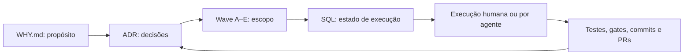
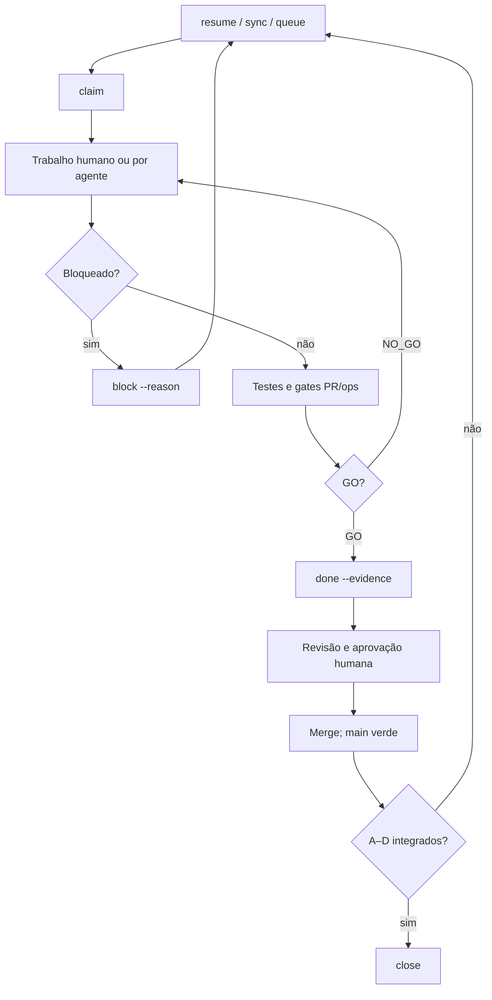

<div align="center">

# WHW — Why · How · What

### Trabalho portátil, retomável e verificável para humanos e agentes de código

[](https://github.com/fabioeloi/WHW/actions/workflows/ci.yml)
[](https://www.npmjs.com/package/@fabioeloi/whw)
[](package.json)
[](package.json)
[](LICENSE)

[Read in English](README.md)

</div>

O WHW organiza o trabalho com **propósito, decisões, estado SQL e evidências**.
Mantenha o contrato de entrega no repositório, retome após interrupções e
revise as mudanças com artefatos que podem ser executados novamente.

**0.2.0 está publicada** no [npm](https://www.npmjs.com/package/@fabioeloi/whw)
e no [GitHub](https://github.com/fabioeloi/WHW/releases/tag/v0.2.0).
A documentação deste repositório evolui separadamente do pacote imutável.
O inglês permanece canônico em caso de divergência.

## Índice

[Valor](#valor) · [Público](#público) · [Início rápido](#início-rápido) ·
[Arquitetura](#arquitetura) · [Ciclo de entrega](#ciclo-de-entrega) ·
[Continuidade](#continuidade) · [Compatibilidade](#compatibilidade) ·
[Evidências e limites](#evidências-e-limites) · [Documentação](#documentação) ·
[Roteiro](#roteiro) · [Contribuição](#contribuição)

## Valor

| Situação | Prática WHW | Artefato revisável |
| --- | --- | --- |
| Retomar após interrupção | Revalidar Git, fila e gates com `resume` | Baseline, estado SQL e checkpoints |
| Trocar de ferramenta | Transferir o contrato com `handoff` e `AGENTS.md` canônico | Documento de transferência e arquivos do repositório |
| Explicar uma decisão | Vincular onda a ADR e WHY | Decisão versionada |
| Revisar a entrega | Exigir evidências e verificações GO/NO_GO | Commits, comandos de teste e PRs |

Contexto durável, governança e verificação orientam o posicionamento.
[Pesquisa e contexto de mercado de setembro/2026](docs/why/positioning.md)
(em inglês) informam essas prioridades; não comprovam resultados do WHW.

## Público

Para desenvolvedores e líderes técnicos que querem escopo explícito,
continuidade e evidências usando humanos ou agentes de código. Comece com
uma onda pequena. O WHW fornece CLI de processo e contratos em arquivos;
sua equipe fornece código, verificações do projeto, revisores e política
de aprovação.

## Início rápido

Requer Node.js **≥22.13**, npm e Git. O WHW tem **zero dependências de runtime**;
`npx` ainda baixa o pacote no primeiro uso. Revise os arquivos gerados antes
de adotar em um repositório existente; este exemplo começa com um vazio.

```bash
mkdir whw-demo
cd whw-demo
git init
npx @fabioeloi/whw@0.2.0 init --tools claude,cursor,codex,copilot,gemini
npx @fabioeloi/whw@0.2.0 doctor
npx @fabioeloi/whw@0.2.0 program new adoption --waves 1
npx @fabioeloi/whw@0.2.0 wave new first-change --adr 0001
```
Neste repositório novo, o ADR do programa gerado é `0001` e a onda é `001`.
Repositórios existentes recebem os próximos números disponíveis: use os
identificadores realmente gerados. Edite `WHY.md`, o charter do programa
(escopo, exclusões, mapa de ondas e critérios de encerramento) e
`docs/plan.md` antes de executar.

```bash
npx @fabioeloi/whw@0.2.0 sync --all
npx @fabioeloi/whw@0.2.0 queue
npx @fabioeloi/whw@0.2.0 claim wave001-A
```
Conclua os artefatos de planejamento A e revise-os antes de registrar:

```bash
npx @fabioeloi/whw@0.2.0 gate run --tier pr
npx @fabioeloi/whw@0.2.0 done \
  wave001-A --evidence "planning/wave-001-first-change.todos.sql; docs/adr/0001-program-adoption.md; npx @fabioeloi/whw@0.2.0 gate run --tier pr"
npx @fabioeloi/whw@0.2.0 status
```
Isso conclui **somente A**. B–E continuam pendentes. Repita o contrato por
letra; `close` exige A–D concluídos, adendo ao ADR e gates de sincronização
verdes. Nunca feche imediatamente após A. Veja [ondas](docs/how/waves.md)
e [exemplo completo](examples/hello-wave/) (em inglês).

Execute o pacote instalado com `npx @fabioeloi/whw@0.2.0` (ou `whw` após
instalação explícita). `init` gera arquivos do processo; **não** copia `bin/`
ou `src/`. Use `node ./bin/whw.js` somente no checkout do código do WHW.

## Arquitetura


`planning/*.todos.sql` é a entrada versionada. `sync` carrega o estado SQLite
local em `.whw/state.db`; a fila com dependências orienta a execução. O banco
é ignorado pelo Git: mantenha evidências em artefatos versionados e regenere
o estado pelos comandos WHW. Transferências em arquivos preservam o contexto
do processo, não a memória oculta do modelo nem o histórico privado do chat.

## Ciclo de entrega

| Letra | Responsabilidade | Entrega |
| --- | --- | --- |
| A | Planejar | Charter, seeds SQL, dependências e aceite |
| B | Implementar | Implementação dentro do escopo |
| C | Verificar | Verificações independentes e evidências reproduzíveis |
| D | Decidir | Adendo ao ADR com resultado e limites |
| E | Encerrar | Fechamento SQL canônico, métricas e integração |


A onda só é terminal quando E faz merge. Gates PR verificam planning,
vínculos com ADR, sincronização de ondas e README, paridade de adaptadores
e segredos. Gates ops acrescentam inventário do programa, qualidade de
evidências, prontidão de release e auditoria de manutenção. Verificam contratos
definidos; aprovação não certifica segurança nem todos os links da documentação.

Papéis (`planner`, `builder`, `evaluator`, `closer`, `autonomous-engineer`)
são instruções Markdown. A avaliação Phase A executa verificações determinísticas
configuradas; Phase B recebe pontuações da rubrica. Esses mecanismos exigem
aceite específico do projeto e revisão independente; exit zero do runner
sozinho não basta.

## Continuidade

```bash
npx @fabioeloi/whw@0.2.0 resume
npx @fabioeloi/whw@0.2.0 handoff --from codex --to claude
```
`resume` verifica baseline Git, sincroniza SQL, mostra a fila e executa gates
PR; não assume tarefas automaticamente. `handoff` registra baseline, snapshot
da fila, resultados de gates e próxima ação. Revise o pacote antes da troca.
Mantenha transcrições privadas e credenciais fora dos artefatos públicos.
Veja [continuidade](docs/how/continuity.md) (em inglês).

## Compatibilidade

| Camada | Contrato disponível | O que estabelece |
| --- | --- | --- |
| Adaptadores gerenciados | Claude, Cursor, Copilot, Gemini, Windsurf | Ponteiros gerados para `AGENTS.md` canônico |
| Leitores nativos/de arquivos | Codex, OpenCode; Aider com `--read AGENTS.md` | Integração por instruções; [referência](docs/what/adapters.md) em inglês |
| Runners configuráveis | Comando CLI externo por `whw run`; escalação pode terminar em humano | CLI instalado/autenticado separadamente; este repositório não configura runner padrão |
| Cenários verificados | Init do consumidor, ciclo SQL, handoff/resume; execução supervisionada do Codex | Limites específicos abaixo; sem certificação universal de modelos/ferramentas |

O WHW não exige API de modelo nem SDK de fornecedor. Suporte a instruções e
disponibilidade do runner são questões separadas. `doctor` descobre executáveis
sem comprovar login, acesso ao modelo ou saúde do backend. Veja
[configuração](docs/what/config.md) (em inglês).

## Evidências e limites

| Capacidade ou prática | Evidência pública (em inglês) | Limite |
| --- | --- | --- |
| Adoção e continuidade | [Verificação do consumidor](docs/how/consumer-proof-verification.md), [teste e2e](tests/e2e/consumer.test.js) | Replay local; sem migração de conversas de modelos nem certificação Windows |
| Runner real | [Prova Codex](docs/how/runner-proof-real.md) | Assistida pelo operador: sandbox bloqueou commit Git; operador finalizou Git/SQL; modelo solicitado não atesta backend |
| Release seguro | [Verificação staged](docs/how/staged-release-verification.md), [workflow](.github/workflows/release.yml) | Recuperação por dispatch observada; essa execução não prova publicação futura por tag |

Este repositório publicou 0.2.0 com OIDC do GitHub Actions, permissão npm
somente para staging e aprovação humana com chave-senha. A attestation da
recuperação identifica o commit main do workflow, não o checkout da tag;
comparação independente dos bytes comprovou o conteúdo da tag. São práticas
deste repositório, não garantias automáticas para quem adota WHW. Veja
[segurança](SECURITY.md) (em inglês).

Não há alegação de ganho medido em benchmark do WHW, economia financeira,
autonomia completa ou conformidade empresarial. Gates shell e runners
executam código configurado por você: revise antes de usar.

## Documentação

Comece pelo [índice de documentação](docs/README.md) (em inglês) ou pela
[jornada completa de adoção pt-BR](docs/pt-BR/README.md).

| Necessidade | Referência (em inglês) |
| --- | --- |
| Propósito e princípios | [WHY](WHY.md), [manifesto](docs/why/manifesto.md), [princípios](docs/why/principles.md) |
| Processo | [Ondas](docs/how/waves.md), [gates](docs/how/gates.md), [evidências](docs/how/evidence.md) |
| Referência técnica | [CLI](docs/what/cli.md), [schema](docs/what/schema.md), [adaptadores](docs/what/adapters.md) |
| Decisões e trabalho atual | [ADRs](docs/adr/), [plano](docs/plan.md), [contrato canônico dos agentes](AGENTS.md) |

## Roteiro

| Estado | Escopo |
| --- | --- |
| 0.1.0 / 0.1.1 publicadas | CLI núcleo, SQL, gates, papéis e distribuição inicial |
| 0.2.0 publicada | Descoberta de runners, continuidade verificada, métricas de execução e prova do consumidor; [changelog](CHANGELOG.md) em inglês |
| Wave 018 | Documentação bilíngue no GitHub; documentação npm atualizada no próximo release |
| Propostas que exigem novos charters | Pós-condições de runners, persistência de contexto mais forte, provas de outras plataformas; sem data prometida |

ADRs históricos permanecem em inglês. Veja [posicionamento](docs/why/positioning.md)
para fontes datadas e [ADR 0016](docs/adr/0016-program-documentation-adoption.md)
para o escopo desta documentação (em inglês).

## Contribuição

Siga [CONTRIBUTING.md](CONTRIBUTING.md) (em inglês): sync, fila, uma tarefa
assumida, implementação por letra, evidências e gates antes do merge.
Relate vulnerabilidades em privado conforme [SECURITY.md](SECURITY.md)
(em inglês). Cada marco termina com **Status / Evidence / Next step**
(estado, evidências e próximo passo).

[MIT](LICENSE) © 2026 Fabio Eloi. A ordem WHY/HOW/WHAT inspira-se em
*Start With Why* (2009), de Simon Sinek, sem afiliação ou endosso;
veja [agradecimentos](ACKNOWLEDGMENTS.md) (em inglês).
