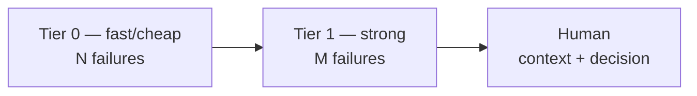

# Escalation

When a task resists, escalate the *resources* — not the panic. WHW's ladder is
explicit: bounded attempts per tier, then the next tier, ending always in a
human.

## The ladder



Configure it in `whw.config.json`:

```json
{
  "runners": { "default": "my-agent --prompt-file \"$WHW_PROMPT_FILE\"" },
  "escalation": {
    "maxFailuresDefault": 2,
    "tiers": [
      { "name": "fast", "runner": "fast-agent < \"$WHW_PROMPT_FILE\"", "maxFailures": 3, "costClass": "open-weight", "model": "llama3.1" },
      { "name": "strong", "runner": "strong-agent < \"$WHW_PROMPT_FILE\"", "maxFailures": 2, "costClass": "closed", "model": "claude" },
      { "name": "human", "human": true }
    ]
  }
}
```

`whw run <role>` walks the ladder: attempts a tier up to `maxFailures`, then
moves on. Prompts accumulate previous failures so tiers do not repeat them.
The `human` tier stops with a handoff summary (exit 3) — a person decides.

## Runner contract

- Input: env vars `WHW_PROMPT_FILE` (markdown prompt), `WHW_ROLE`, `WHW_REF`,
  `WHW_ROOT`, `WHW_ATTEMPT`, `WHW_TIER`.
- Output: exit `0` = task complete **with evidence recorded**
  (`whw done --evidence`). Anything else = failure, with the tail logged to
  `.whw/runs/<role>-<stamp>-attemptN.log`.
- `--dry-run` prints the composed prompt without invoking anything.
- `--max-attempts` caps the loop regardless of tiers.

Examples per CLI (flags vary by version — adapt to your installed one):

```bash
# Open-weight — Ollama
ollama run llama3.1 < "$WHW_PROMPT_FILE"
# Open-weight — llama.cpp
llama-cli -m /models/llama.gguf -f "$WHW_PROMPT_FILE" -n 2048
# Open-weight — Aider + local Ollama
aider --model ollama_chat/llama3.1 --message-file "$WHW_PROMPT_FILE" --yes-always

# Closed — Claude Code (print mode, permissions pre-approved by you)
claude -p --dangerously-skip-permissions "$(cat \"$WHW_PROMPT_FILE\")"
# Closed — Codex (non-interactive)
codex exec --skip-git-repo-check - < "$WHW_PROMPT_FILE"
# Closed — Gemini CLI
gemini --prompt "$(cat \"$WHW_PROMPT_FILE\")"
```

A ladder that tries a local model first, then a hosted CLI:

```json
{
  "escalation": {
    "tiers": [
      { "name": "local", "runner": "ollama run llama3.1 < \"$WHW_PROMPT_FILE\"", "maxFailures": 2, "costClass": "open-weight", "model": "llama3.1" },
      { "name": "hosted", "runner": "claude -p --dangerously-skip-permissions \"$(cat \\\"$WHW_PROMPT_FILE\\\")\"", "maxFailures": 1, "costClass": "closed", "model": "claude" },
      { "name": "human", "human": true }
    ]
  }
}
```

Only configure runners you trust with shell execution — `whw run` is power
tools, and `SECURITY.md` applies.

## When to escalate vs. when to stop

- **Escalate tiers** on repeated execution failure (same ref, new errors).
- **Stop to human** on ambiguous intent, risky/irreversible changes, or tests
  disproving the approach — the ladder's last tier is a person, not a bigger
  model.
- **Never escalate** naming, style, or equivalent technical choices; the role
  conventions already decide those.
