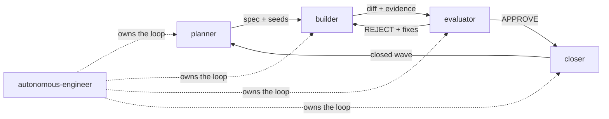

# Roles and context strategy

Roles separate responsibilities; context strategies separate memory. Any model
— frontier or open, large or small — can play any role, because the handoff is
files, not weights.

## The five roles

| Role | Job | Reads | Writes |
| ---- | --- | ----- | ------ |
| `planner` | Idea → verifiable plan + seeds | WHY, ADRs, queue, codebase | spec, wave seeds |
| `builder` | Claimed todo → minimal diff + evidence | todo, ADR, spec | code, commits, evidence |
| `evaluator` | Change → APPROVE/REJECT + fixes | diff, ADR, criteria | evaluation report |
| `closer` | Wave → canonical close | seeds, ADR, plan, gates | addendum checks, close |
| `autonomous-engineer` | Own the full loop | everything above | everything above |

Role prompts live in `roles/` (frontmatter: `name`, `description`, `model`,
`tools`, `context_strategy`, `context_handoff`); skill wrappers in `skills/`
follow the Agent Skills spec.

## Context strategies

| Strategy | Meaning | Used by |
| -------- | ------- | ------- |
| `compaction` | One long session; summarize as context fills | planner (single session per feature) |
| `reset` | Fresh context per unit of work; state via handoff files | builder (per wave), evaluator (per review), closer (per close) |
| `sql-backed` | The database is memory; narrative in `plan.md` | autonomous-engineer |

The rationale: smaller models degrade with stale context ("context anxiety"),
while planning benefits from continuity. Resets are safe only because the
handoff files (`todos.sql`, spec, ADR, evaluation report) carry everything the
next pass needs. If a reset loses information, the handoff — not the model —
is broken; fix the files.

## Separation of duties

- The evaluator never rewrites code in the same pass it rejects (REJECT
  returns to the builder).
- The closer never writes implementation (narrative fixes only).
- The planner never implements (plans are reviewed before waves start).
- `autonomous-engineer` may play all letters, but still runs the evaluator's
  two phases before claiming done — wearing two hats sequentially, not
  skipping the review.

## Subagents

When your runner supports subagents: one role per subagent, handoff via SQL +
files, never via pasted chat. The parent claims the wave letters; children
claim individual refs. Prompts compose the same way `whw run` does (role +
`AGENTS.md` + queue context).
