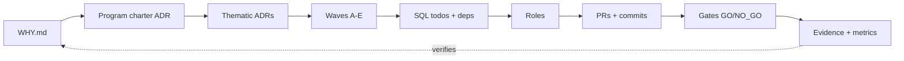

# Manifesto — Why · How · What

> The Why → How → What ordering is inspired by Simon Sinek's *Start With Why*
> (2009). WHW is an independent project, not affiliated with or endorsed by
> Simon Sinek. See `ACKNOWLEDGMENTS.md`.

## WHY — purpose is the root of the tree

Most agent harnesses start with *what*: prompts, tools, file layouts. WHW
starts one level deeper: **why does this work exist, and how will we know it
served its purpose?**

- Every repository carries a `WHY.md`: purpose, non-goals, principles.
- Every significant choice is an **ADR** that traces to that WHY.
- Every unit of execution (a **wave**) traces to an ADR.
- Every **todo** traces to a wave.

**No todo without a wave, no wave without an ADR, no ADR without a WHY.**
A todo that cannot name its wave is drift. A wave that cannot name its ADR is
motion without decision. An ADR that cannot name its WHY is process theater.

## HOW — process turns prompts into delivery

Purpose without process is a poster. WHW's HOW is a small set of mechanisms
with no special cases:

- **Waves (A–E).** Plan → Build → Verify → Decide → Close. Five letters, five
  small PRs, always shippable. A wave is done only when **E** merges.
- **Programs.** Waves group into programs chartered by an ADR with explicit
  exclusions and a close wave. No wave N+1 without a new charter — scope creep
  needs a decision, not momentum.
- **SQL execution state.** `planning/*.todos.sql` seeds are versioned intent;
  `whw sync` loads them into SQLite; agents work a dependency-aware queue.
  Sessions resume from the database, never from chat memory.
- **Gates with proof.** GO/NO_GO checks with timestamped checkpoints. Two
  tiers: `pr` (blocking, deliberately lean) and `ops` (on demand).
- **Roles, not models.** Planner, builder, evaluator, closer, and the
  full-loop autonomous engineer are tool-neutral contracts with per-role
  context strategies. Any model can play any role; the files are the handoff.

## WHAT — artifacts are the truth

What ships is not claims but artifacts a stranger could re-run:

- atomic commits and small PRs with wave trailers;
- gate checkpoints (`.whw/checkpoints/<gate>/latest.txt`);
- evidence on every `done` (commits, PRs, test output);
- ADR addenda and plan entries that keep narrative in sync with execution;
- reproducible metrics (`whw metrics`).

Verification runs **outside-in**: evidence (WHAT) proves the gates (HOW)
satisfied the ADR's acceptance (WHY). If the chain breaks anywhere, the work
is not done — no matter what the chat says.

## The bet

Models will keep changing — faster, cheaper, differently shaped. Tools will
keep changing — new CLIs, new IDEs, new protocols. What survives is **process
with state**: versioned intent, recorded decisions, executable checks, and an
audit trail. WHW is that process, packaged so any model and any tool can run
it: files and SQL in, evidence out.

Build the WHY once. Run the HOW forever. Trust only the WHAT.
